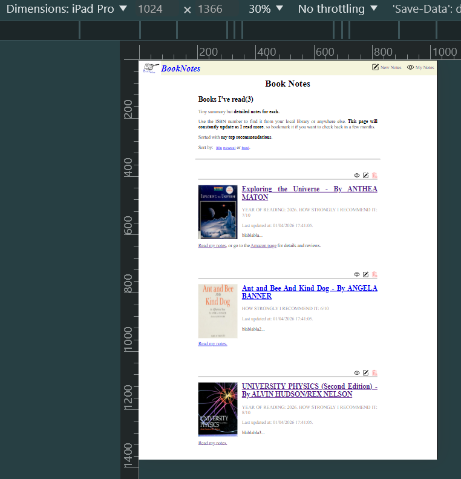
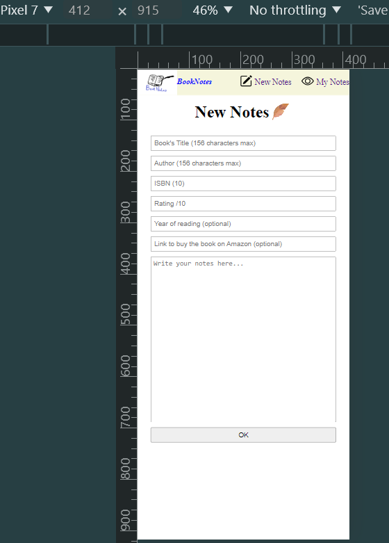
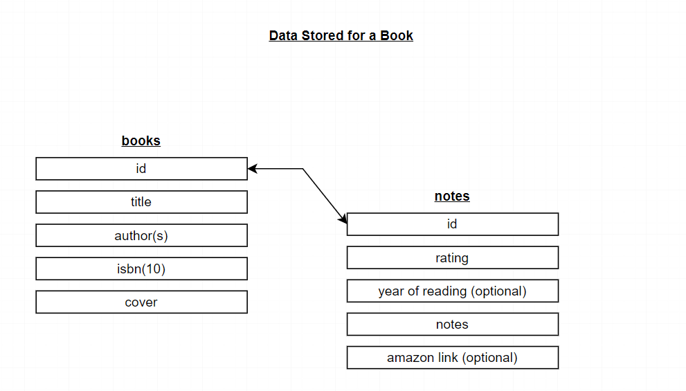
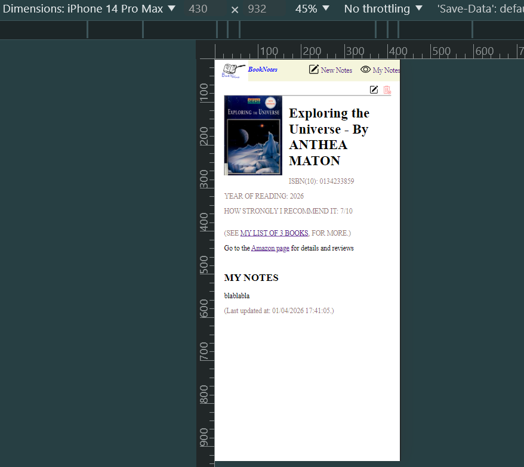
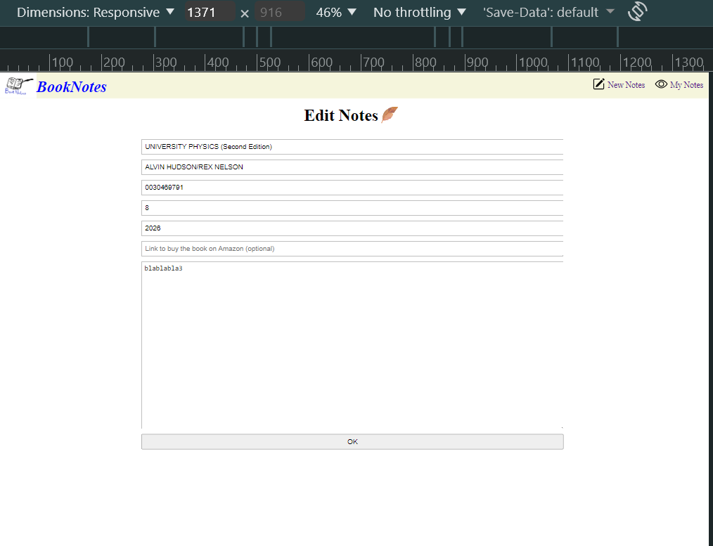
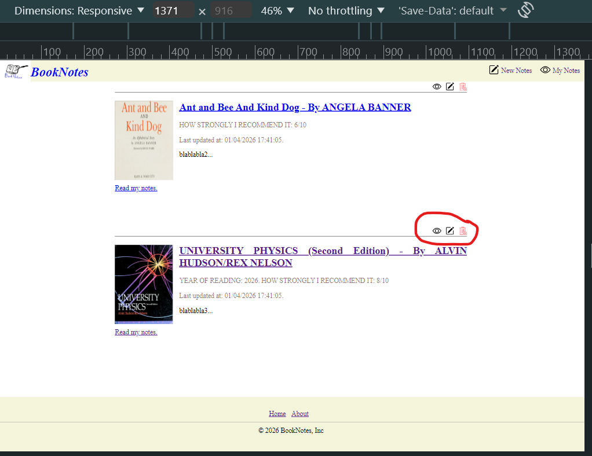
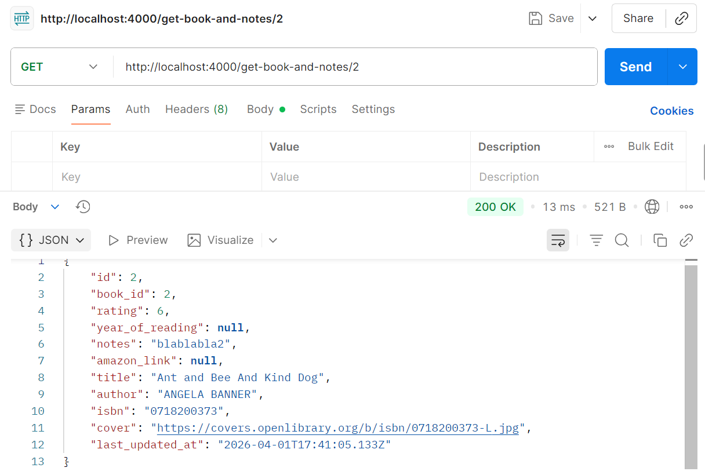
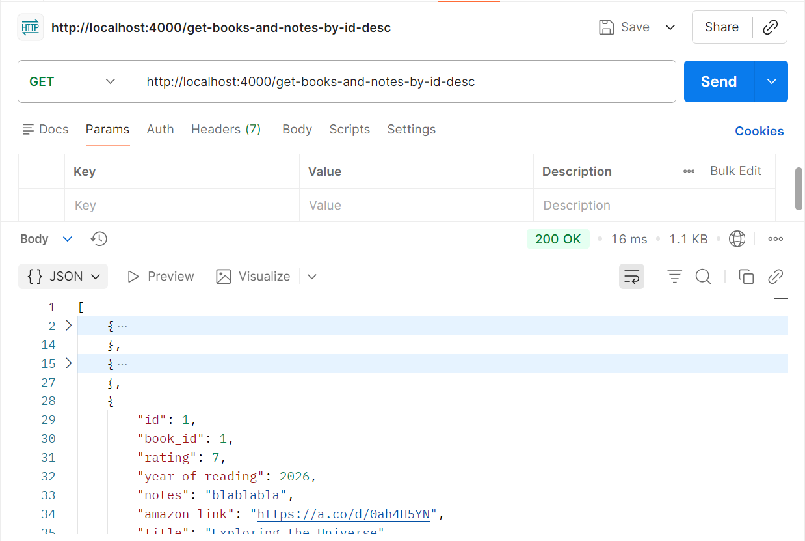

# Book_Notes
Some notes on some books read.

## What is this?
Book_Notes is a project I made as an exercise given by Angela Yu in her Webdev course(https://www.udemy.com/course/the-complete-web-development-bootcamp/).
It's inspired from this Derek Siver's website: https://sive.rs/book.

It's a webApp for Notes taking on some books you read.

## Features
- No Authentication required.

- Responsive Website.

- Create new Notes about some Book

- The data gets stored in a Postgres Database with this Structure.

- Read the Notes on a choosen book.

- Edit some Notes.

- Delete Notes.

- An API to allow other people or agents to fetch all the Books and Notes or the Notes on a particular by id.

## Tech used
Javascript

NodeJS        v24.13.0 https://nodejs.org/

Nodemon       v3.1.11  https://www.npmjs.com/package/nodemon  (optional)

Express       v5.2.1   https://www.npmjs.com/package/express

EJS           v3.1.10  https://www.npmjs.com/package/ejs

PostgreSql    v18.1-2  https://www.postgresql.org/docs/current/index.html

Body-parser   v2.2.2   https://www.npmjs.com/package/body-parser

Pg            v8.20.0  https://www.npmjs.com/package/pg

Dotenv        v17.3.1  https://www.npmjs.com/package/dotenv

Axios         v1.14.0  https://www.npmjs.com/package/axios

PgAdmin4

Postman to test the API

## Installation
First go in PgAdmin, and create a new database. 
On my side, for this project I named that database "book_notes".
Copy what's inside queries.sql and paste it to run a query for this new database. 
You'll create the Database Structure necessary to run this project.
(Optional: you can also run what's inside test-data.sql to get some test datas).

In your IDE's terminal, cd into the project then run ---  npm i  --- or ---  npm install  --- to install the express, ejs, body-parser, pg, dotenv and axios dependencies.

Create a new file named .env, then inside it, paste what's in .env.example and replace the variables names with the correct values about your database. (Mandatory to run this project).

You can now run --- node server.js --- or --- nodemon server.js --- in your IDE terminal to start the server and browse the website while performing some CRUD operations.

Run -- node api.js -- or -- nodemon api.js -- in the terminal to run the Api if you want.
